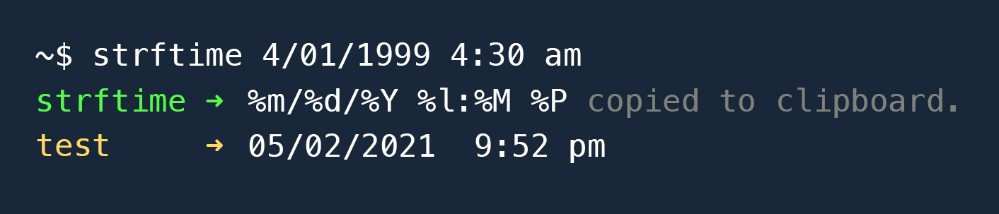

# Reverse strftime

Strftime directives on the command line. Pass in a date, get back the directives.



## Installation

Must be installed globally (so it's available from the command line).

```bash
# yarn
yarn global add reverse-strftime

# or npm
npm i -g reverse-strftime
```

## Usage

In the console, input your desired date format:

`strftime [date string] (options)`

```bash
strftime Saturday January 1, 2020
# ➜ %A %B %e, %Y

strftime Sat. Jan. 01, 20
# ➜ %a. %b. %d %y

strftime 4/4/21
# ➜ %m/%e/%y

strftime 4-04-2021
# ➜ %m-%d-%Y

strftime Mon. January 1, 2044 14:40:45
# ➜ %a. %B %e, %Y %H:%M:%S

strftime 4/4/4444 4:40:45 am
# ➜ %m/%e/%Y %l:%M:%S %P

```

## Options

### \<locale\>

Reverse-strftime uses the system locale by default, and matches date format conventions against your input.
(e.g. You're in London => day precedes month).

Use `<locale>` option to indicate if your input is for a date format that differs from the system's default locale.

`strftime [datestring] -l --locale`

```bash
# System locale => en-US (M/D/YYYY)
# Let's generate a string for en-GB (D/MM/YYYY)

strftime Mon. 31/12/1999 -l en-GB
# ➜ %a. %d/%m/%Y


# Already in London? You don't have to use `-l` to for the same output:

# System locale => en-GB (D/MM/YYYY)

strftime Mon. 31/12/1999
# ➜ %a. %d/%m/%Y

```

### <auto\>

Auto generate strftime string.
Optionally pass in a locale (see above) to generate a string in non-local format.

`strftime -a --auto`

```bash
# locale: en-US

strftime -a
# ➜ %A, %B %d, %Y at %H:%M:%S %p
# ➜ Monday, May 17, 2021 at 23:34:26 PM

# Let's autogenerate for another locale

strftime -a -l en-GB
# ➜ %A, %d %B %Y at %H:%M:%S
```

### \<auto>\<short>

When autogenerating, prefer short-format.

`strftime -a -s --short`

```bash
strftime -a -s
# ➜ %m/%d/%y, %H:%M %p
```

## Usage Notes

### Option condensing

As usual, you can combine commands

```bash
strftime -asl en-GB
# ➜ %d/%m/%Y, %H:%M
```

### Format-focused

The date does not have to be accurate, only recognizable. i.e. you don't have to think about the date (just the format).

```bash
# New Year's Eve in 1999 was actually a Friday,
# but this still prints the correct strftime:

strftime Sunday December 31, 1999
# ➜ %A %B %d, %Y

```

### Full dates / order

reverse-strftime mostly expects full dates, or at least partial dates in order.

```bash
# This is fine

strftime June 1
# ➜ %B %e

# But it'll bonk if time is added and
# year is skipped:

strftime June 1 4pm
# ➜ %B %e %y%P
```
